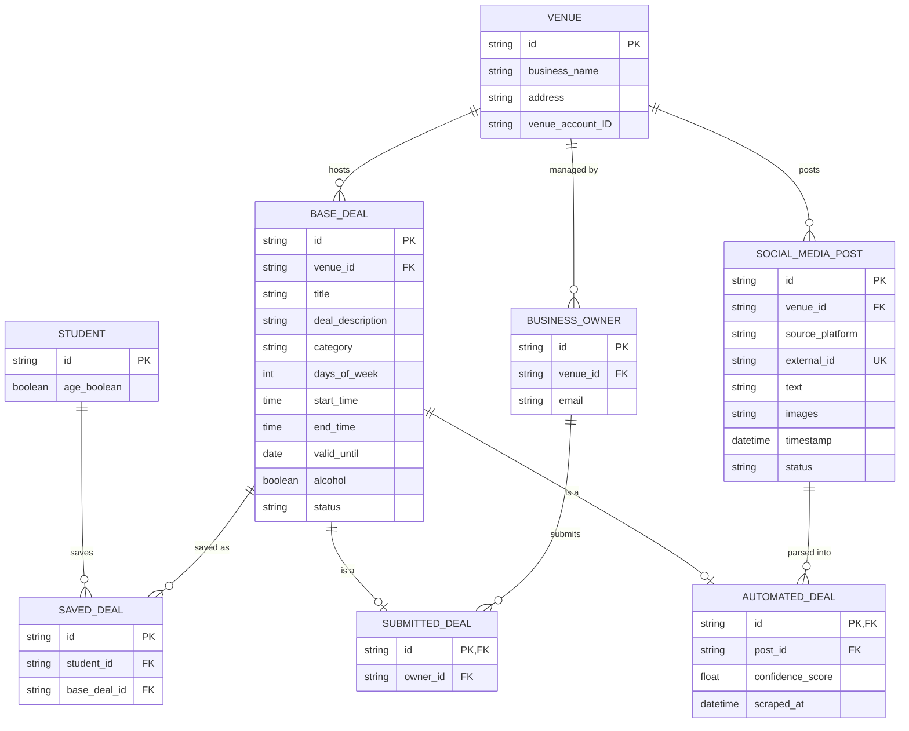

# BarCat Deals: Detailed Design (D1)

**Team Members:** Kaustubh Mathur, Brian Nguyen, Ved Sanap, Meredith Bartel, Kiki Vasilev
**Course:** Capstone [CONFIRM course name and number]
**Advisor:** Dr. Hrishikesh Vinayak Bhide
**Assignment:** Design D1 - Detailed Design
**Date:** October 7, 2026
**Document Version:** 0.1

---

# 1. Header, Scope, and Conventions

## Project Title

**BarCat Deals: AI-Assisted Deal Aggregation for Bars and Restaurants Near the University of Cincinnati**

## Goal Statement

BarCat Deals gives University of Cincinnati students an easier way to find deals around campus. By using AI, the system automatically finds deals in businesses' social media posts, and business owners can also submit their own deals. Students can search deals that are active right now and save the ones they like.

**Basic input:** Social media posts processed by an AI, and manual deal submissions from business owners.
**Basic output:** Deals from bars and restaurants around campus, served to students as JSON.

## Scope

This document details the **Backend API Service (C3)** and the **Deal Ingestion Service (C5)**, together with the data they use in the **Deal Database (C4)**. It covers the deal extraction and de-duplication algorithm and the active-deal search algorithm. The Student Web App (C1), Owner Web Portal (C2), and External Social Media APIs (C6) are deferred to D2.

## Diagram Conventions

* Rectangular boxes represent database tables (entities) and their attributes. Only attributes that matter for behavior are shown.
* `PK` identifies a primary key. `FK` identifies a foreign key that references a record in another table. `UK` identifies a unique constraint.
* Lines between tables show relationships. Crow's foot symbols show cardinality: `||` means exactly one, `o|` means zero or one, and `o{` means zero or more.
* Times use local Eastern time ("HH:MM") unless a field is marked UTC.
* D0 component names (C1 to C6) and interface IDs (I1 to I5) keep the meaning they have in D0.

---

# 2. Data Model, the D1 Diagram

## 2.1 Entity-Relationship Diagram

BarCat Deals stores every deal in a shared base table, plus one extra table for each source: owner submissions and automated extractions. Raw social media posts are stored separately, so one post can produce several deals and the original text is kept for debugging.



Compared with the earlier diagram, `days_and_times` is replaced by `days_of_week`, `start_time`, and `end_time`, so search can check whether a deal is active without parsing text. `title`, `valid_until`, and `status` are added to `BASE_DEAL`, and `status` and `external_id` are added to `SOCIAL_MEDIA_POST`.

## 2.2 Entity Descriptions

| Entity | Purpose |
| --- | --- |
| `STUDENT` | A student user. `age_boolean` is true once the student confirms they are 21 or older. |
| `SAVED_DEAL` | A bookmark linking one student to one deal. |
| `BUSINESS_OWNER` | An owner who manages one venue and may submit deals for it. |
| `VENUE` | A bar or restaurant near campus, with its address and social media account ID. |
| `SOCIAL_MEDIA_POST` | A raw post fetched from a venue's account, with its processing status. |
| `BASE_DEAL` | The common record for every deal: description, category, weekdays, start and end time, alcohol flag, and status. |
| `SUBMITTED_DEAL` | Extra data for a deal an owner entered by hand: which owner submitted it. |
| `AUTOMATED_DEAL` | Extra data for a deal found by the AI: its source post, confidence score, and last scraped time. |

## 2.3 Structural Decisions

| Decision | Rationale |
| --- | --- |
| Relational database, not key-value or document | Every entity links to others by keys, and everyone on the team knows SQL. |
| `VENUE` is its own entity | A venue has its own attributes and hosts many deals and posts over time. Keeping it separate avoids repeating values on every deal row. |
| `SOCIAL_MEDIA_POST` is its own entity | Raw posts are stored before parsing. This keeps history for debugging, and one post can contain several deals. |
| `SAVED_DEAL` is its own entity | A student saves many deals and a deal is saved by many students, so an explicit join table is needed. |
| `BASE_DEAL` split into `SUBMITTED_DEAL` and `AUTOMATED_DEAL` | Both kinds share description, category, times, and the alcohol flag, but each has its own source data. Splitting avoids many empty columns. |
| Weekdays, start time, and end time stored as separate fields | "Is this deal active now?" becomes a simple comparison and needs no text parsing. |
| `venue_id` on `BUSINESS_OWNER` | The API can check that an owner submits deals only for their own venue. |
| `status` on `BASE_DEAL` | Low-confidence automated deals are stored but never shown, and old deals are hidden without being deleted. |

## 2.4 Indexing Decisions

BarCat Deals indexes `BASE_DEAL.alcohol`, because every student search filters on it. Every foreign key (`venue_id`, `student_id`, `base_deal_id`, `owner_id`, `post_id`) is indexed because listing a student's saved deals and a venue's deals needs constant joins. `AUTOMATED_DEAL.scraped_at` is indexed so old deals can be found and hidden quickly. The unique pair (`source_platform`, `external_id`) on `SOCIAL_MEDIA_POST` stops the same post from being stored twice. Free-text fields are not indexed because nothing searches them, and every extra index slows writes.

## 2.5 Deal Lifecycle

1. C5 fetches a post and stores it with status `new`.
2. C5 extracts deals from the post and sends them to C3.
3. C3 sets each deal's status from its confidence score: `published`, `pending_review`, or `rejected`.
4. Owner submissions skip steps 1 to 3 and are `published` immediately.
5. A background job sets a deal to `expired` after its `valid_until` date.
6. Only `published` deals are returned by search.

---

# 3. Core Algorithms

Two computations break the product if they are wrong. Extraction fills the feed with wrong, duplicate, or unflagged alcohol deals if it fails. Search shows students deals that are over, or alcohol deals they should not see, if it fails. Neither is heavy work at our size, so the risk is correctness, not speed.

**Assumed data size:** about 50 venues posting about 2 times a day gives about 100 posts a day. About 300 deals are live at a time, and about 50,000 deal rows exist after a year. At 100 times that, there are about 10,000 posts a day and about 5 million rows.

## 3.1 Algorithm A: Deal Extraction and De-duplication

### Purpose

Turns one social media post into zero or more structured deals without storing the same deal twice. C5 extracts and checks each deal. C3 saves it, because only C3 talks to the database.

### Inputs and Outputs

| Parameter | Type | Description |
| --- | --- | --- |
| `post_id` | `string` | A post in `SOCIAL_MEDIA_POST`. |
| `venue_id` | `string` | The venue that posted. |
| `text` | `string` | Post caption, 0 to 5,000 characters. |
| `images` | `array of URLs` | 0 to 10 flyer images. |
| `timestamp` | `UTC datetime` | Used to turn "tonight" into a real date. |

Output:

* An array of 0 to 10 deals. Each has `title` (string, up to 120 characters), `deal_description` (string, up to 1,000), `category` (`food`, `drink`, or `other`), `alcohol` (boolean), `days_of_week` (integers 1 to 7), `start_time` and `end_time` ("HH:MM"), `valid_until` (date or null), and `confidence_score` (float from 0 to 1).
* One result per deal: `inserted`, `merged`, `pending_review`, or `rejected`. The post becomes `processed`, `no_deal`, or `failed`.

### Approach

1. C5 picks up posts with status `new`, one worker per post. A post with no text and no images becomes `no_deal`.
2. C5 sends the text, images, and post date to the AI model and asks for JSON with explicit dates.
3. C5 checks the JSON: end time differs from start time, dates are real and within 60 days, and at least one weekday is set.
4. `alcohol` is true if the AI says so or a keyword matches (beer, wells, shots, draft, happy hour, 21+). When unsure, it is true.
5. C3 applies a confidence gate: 0.70 or higher is `published`, 0.40 to 0.69 is `pending_review`, and below 0.40 is `rejected`. These thresholds are starting values to tune.
6. C3 compares the deal with the same venue's live deals. If weekdays and times match and the title words are at least 80% alike (Jaccard similarity), it merges: `scraped_at` is updated and the higher confidence is kept. Otherwise it inserts a new deal.

### Complexity

Each post needs one AI call (about 2 to 10 seconds), so about 100 calls a day. Merging compares against about 20 live deals for one venue, so it takes \(O(k)\) time for \(k\) candidates. At 100 times the volume, that is about 7 posts a minute, which a few workers can handle. Only cost and rate limits grow, so the algorithm does not need tuning.

### Why This Approach

Regex or rule-based parsing breaks on emoji, flyers, and varied wording. A trained model would need labeled posts we do not have. Exact-match de-duplication misses reworded re-posts, and embeddings are too heavy for about 20 candidates. An AI model with a fixed JSON format needs no training data and costs little at this volume, and Jaccard matching is simple and easy to test.

### Edge Cases

* **Empty post or no deal:** Mark `no_deal` and store nothing.
* **Several deals in one post:** Save each one with the same `post_id`.
* **Same post fetched twice:** Blocked by the unique pair (`source_platform`, `external_id`).
* **Same deal re-posted or posted on two platforms:** Merge it.
* **Two existing deals both match:** Merge into the most recently scraped one.
* **Unclear dates or "until close":** Lower the confidence so the deal goes to review.
* **Bad AI output:** Retry once. After 3 attempts, mark the post `failed`.
* **AI service down:** Leave the post `new` and retry later with a growing delay. Never publish unchecked output.

## 3.2 Algorithm B: Active-Deal Search with the 21+ Gate

### Purpose

Returns the deals that are active right now, filtered and sorted, and never returns alcohol deals to a student who has not confirmed they are 21 or older. This runs on every page load.

### Inputs and Outputs

| Parameter | Type | Description |
| --- | --- | --- |
| `at` | `datetime with offset` | Time to search at. Defaults to now. |
| `venue_id`, `category` | `string`, `enum` | Optional filters. |
| `include_alcohol` | `boolean` | Defaults to false. |
| `sort`, `limit`, `cursor` | `enum`, `integer 1 to 50`, `string` | Ordering and paging. |
| caller | anonymous or student | Taken from the login token, never from the request. |

Output:

* An array of deals, each with `minutes_remaining` (integer, minutes), and a `next_cursor` (string or null).

### Approach

1. Convert `at` to Eastern time to get a weekday and a time of day.
2. Keep deals that are `published`, not past `valid_until`, and whose weekday and time window contain now. For overnight deals (end earlier than start), also match when the previous weekday is set and the time is before the end.
3. Include alcohol deals only if `include_alcohol` is true and the caller is a logged-in student with `age_boolean` true.
4. Sort food deals first, then by `minutes_remaining`, then by `id`. Page with a cursor, not offsets.

### Complexity

About 300 live deals, so one indexed query takes about a millisecond. At 100 times (about 30,000 live deals) it is still fast, because indexes on `status` and `alcohol` keep the scan to live rows. We will time the query with 100 times test data before tuning anything.

### Why This Approach

Creating one row per future occurrence would need a job to generate rows, and it would have to be redone on every edit. Text schedules such as cron strings need a parser we would have to maintain. Offset paging skips or repeats rows when deals expire between pages. Weekday flags with explicit start and end times need no parsing and no generator job.

### Edge Cases

* **No matching deals:** Return `200` with an empty list, not an error.
* **Overnight deals:** A Thursday 9 PM to 2 AM deal still shows at 1 AM Friday.
* **Daylight saving:** Handled by the standard time zone library using local clock time.
* **Anonymous caller or `age_boolean` false asks for alcohol:** Return `403`, so the app can prompt for confirmation.
* **Expired or future-dated deals:** Excluded, and a background job sets `status` to `expired`.
* **Bad `at`, `limit`, or `cursor`:** Return `422`.
* **Database timeout:** Return `503`.
* **Ties in the sort:** Broken by `id`.

---

# 4. Build-versus-Reuse Decisions

| Component | Build or Reuse | Library or Service | License / Terms | Reason |
| --- | --- | --- | --- | --- |
| Relational database | Reuse | PostgreSQL | PostgreSQL License | Mature; supports the indexes and transactions we need. |
| Table design, constraints, indexes | Build | None | Project license to be selected | Comes from our requirements. |
| Database access and migrations | Reuse | SQLAlchemy and Alembic | MIT | Mature; parameterized queries block SQL injection. |
| API framework | Reuse | FastAPI | MIT | Mature and async; generates API docs automatically. |
| Request validation | Reuse | Pydantic | MIT | Checks types and ranges from the API contract. |
| Login and sessions | Reuse | Supabase Auth (or Auth0) | MIT (self-hostable); hosted-service terms | We do not hand-roll passwords. Free tier limits to be checked. |
| Collecting posts (C5 from C6) | Reuse | Official Meta Graph and X APIs | Platform terms | Stable. Unofficial scrapers break platform terms and get blocked. |
| Reading posts into deals | Reuse | Anthropic API and Python SDK | SDK MIT; API terms | Handles messy captions and flyers; low cost at about 100 calls a day. |
| Dates and time zones | Reuse | `zoneinfo`, python-dateutil | PSF; Apache and BSD | No hand-written date logic. |
| Scheduling | Reuse | APScheduler | MIT | Simple polling with no extra service. |
| HTTP calls | Reuse | httpx | BSD-3-Clause | Timeouts and retries built in. |
| Active-deal search, 21+ gate, owner-venue check | Build | Project implementation in Python | Project license to be selected | Specific to our product and the part we must get right. |
| Duplicate matching | Build | Python standard library | Project license to be selected | About 20 lines, so a dependency is not worth it. |
| Automated tests | Reuse | pytest | MIT | Fixtures suit seeding test data. |

The selected libraries and services should be checked for active maintenance, documentation, license compatibility, performance, and fit with the team's environment. License names above are from memory, so each teammate should open the project's repository and confirm the license file before final submission. Official social media APIs also limit reading other accounts' posts, so the owner submission path is the fallback. Confirm what each API allows before D2.

---

# 5. API Contract

C3 exposes endpoints to the clients (interfaces I1 and I2) and to C5 (interface I3). All bodies are JSON. Weekdays are 1 (Monday) to 7 (Sunday). Every error body has the shape `{"error": {"code": string, "message": string}}`.

## 5.1 Endpoints

| Method and Endpoint | Inputs | Success Response | Error Responses |
| --- | --- | --- | --- |
| `GET /api/v1/deals` (C1) | Optional query: `at` datetime with offset (default now, at most 14 days ahead); `venue_id` string; `category` (`food`, `drink`, `other`); `include_alcohol` boolean (default false); `sort` (`default`, `ending_soon`, `venue_name`); `limit` integer 1 to 50 (default 20); `cursor` string. Optional bearer token | `200`: `data` array (each with `deal_id` string, `venue` {`venue_id`, `name`, `address`}, `title`, `deal_description`, `category`, `alcohol` boolean, `source` (`owner` or `automated`), `days_of_week` integer array, `start_time`, `end_time`, `minutes_remaining` integer in minutes, `valid_until` date or null), `next_cursor` string or null, `generated_at` UTC timestamp | `401` token sent but invalid or expired; `403` `include_alcohol=true` from an anonymous caller or a student with `age_boolean` false; `422` invalid parameter; `429` too many requests; `503` database unavailable |
| `GET /api/v1/deals/{deal_id}` (C1) | `deal_id` string, required | `200`: one deal, same fields as above without `minutes_remaining` | `403` alcohol deal and caller not confirmed 21+; `404` deal missing or not published; `503` database unavailable |
| `POST /api/v1/owner/deals` (C2, owner login) | `title` string 1 to 120; `deal_description` string 1 to 1,000; `category` enum; `alcohol` boolean; `days_of_week` array of 1 to 7 unique integers from 1 to 7; `start_time`, `end_time` "HH:MM" (not equal); optional `valid_until` date, at most 1 year ahead. Venue comes from the owner's record, never the body | `201`: the new deal with `status: "published"` | `400` malformed JSON; `401` not signed in; `403` caller is not an owner, or owner has no venue; `409` duplicate deal (includes the existing `deal_id`); `422` invalid field; `503` database unavailable |
| `PUT` and `DELETE /api/v1/me/saved-deals/{deal_id}` (C1, student login) | `deal_id` string, required | `PUT`: `200` with `{"deal_id": string, "saved": true}`. `DELETE`: `204` | `401` not signed in; `404` deal not found; `503` database unavailable |
| `POST /api/v1/internal/automated-deals` (C5, header `X-Service-Key`) | `post_id` string; `deals` array of 0 to 10 extracted deals (fields as in Algorithm A) | `200`: `results` array with `index` integer, `disposition` string, `deal_id` string or null | `401` invalid service key; `404` post not found; `422` invalid deal; `503` database unavailable |

Sending a post that is already processed replays the stored results and creates nothing new.

## 5.2 Example Request and Response

Example request:

```http
GET /api/v1/deals?category=drink&include_alcohol=true&limit=1
Authorization: Bearer <token issued after sign-in>
Accept: application/json
```

Example success response:

```json
{
  "data": [
    {
      "deal_id": "d_0412",
      "venue": { "venue_id": "v_07", "name": "Example Bar", "address": "123 Calhoun St" },
      "title": "$3 Wells",
      "deal_description": "$3 well drinks until close",
      "category": "drink",
      "alcohol": true,
      "source": "automated",
      "days_of_week": [3],
      "start_time": "21:00",
      "end_time": "02:00",
      "minutes_remaining": 275,
      "valid_until": null
    }
  ],
  "next_cursor": null,
  "generated_at": "2026-10-08T01:25:00Z"
}
```

The values are illustrative. `generated_at` is Wednesday 9:25 PM Eastern, so 275 minutes remain until 2:00 AM.

## 5.3 Age Confirmation Handling

Alcohol deals are filtered on the server using the stored `age_boolean`, never a value sent by the client. An anonymous caller or a student who has not confirmed they are 21 or older gets `403` when asking for alcohol deals, so the app can prompt for confirmation instead of silently hiding them. Deals are never filtered only in the browser.

## 5.4 Versioning

The API uses the `/api/v1` prefix. Adding an endpoint or an optional response field is not a breaking change. Removing or renaming a field, changing a field's type or unit, making an optional input required, or changing what an error code means is a breaking change and requires `/api/v2`, while `/v1` keeps working for a notice period the team sets.

---

# 6. Technology Choices with Justification

Items marked **[CONFIRM]** depend on team facts that must be checked before submission.

## 6.1 Database: PostgreSQL

PostgreSQL is the selected database because every BarCat Deals entity is related to others and we need unique constraints. **Team skill fit:** Everyone on the team has used SQL and databases, and PostgreSQL is standard SQL. **Licensing:** The PostgreSQL License is permissive and free. **Community support:** It is widely used, with full official documentation and many answered questions. **Performance:** Our data is small (about 50,000 rows now, about 5 million at 100 times) and the frequent queries are indexed lookups, so responses take milliseconds. **Cost and hosting:** The software is free, and managed instances have free or low-cost tiers (check current limits). MongoDB was considered as an alternative, but our data is relational and we need unique constraints and transactions.

## 6.2 Backend: Python with FastAPI

Python with FastAPI is the selected backend for C3 and C5, so both can share validation code. **Team skill fit:** Kaustubh Mathur writes Python daily (pandas, Tkinter automation) and has used AWS S3. No one is confirmed on FastAPI, but it is a thin layer over Python **[CONFIRM: other teammates' Python experience]**. **Licensing:** Python (PSF), FastAPI, Pydantic, and SQLAlchemy (MIT) have no fees or restrictions. **Community support:** All are widely used with strong documentation, and the Anthropic SDK supports Python. **Performance:** Peak load is a few requests a second, and the slow part is the AI call, which runs in the background. **Cost and hosting:** It runs in one small container. Node.js with Express was considered, but we chose one language across C3 and C5. Django was also considered, but we do not need its admin site.

## 6.3 Front End: React with Vite

React with Vite is the selected front end for the student app (C1) and owner portal (C2), which D2 will detail. **Team skill fit:** React is the most common front-end library in coursework **[CONFIRM: who has used it]**. Kaustubh has built and deployed a personal site on Netlify. **Licensing:** React and Vite use the MIT License. **Community support:** React has the largest front-end ecosystem. **Performance:** The pages are forms and lists, so the built files are small and load fast on a phone. **Cost and hosting:** The build is static files, which many platforms host for free. Server-rendered pages from FastAPI templates were considered, but C1 and C2 are separate clients of C3.

## 6.4 Job Processing: Database Table as the Queue

C5 uses a `status` column on `SOCIAL_MEDIA_POST` as its work queue instead of a separate message broker. **Team skill fit:** The team already knows SQL, so this is easy to understand and debug. **Licensing:** Nothing extra to license. **Community support:** Picking rows with `FOR UPDATE SKIP LOCKED` is a well-known PostgreSQL pattern, and APScheduler (MIT) handles the polling schedule. **Performance:** 100 posts a day (10,000 at 100 times) is far below what this approach handles. **Cost and hosting:** No second service to pay for or host. Redis with Celery was considered, but a broker adds cost and moving parts we do not need.

## 6.5 Hosting

The backend and ingestion worker run in a managed container host connected to a managed PostgreSQL database, and the front end runs on a static host. **Team skill fit:** Deploying from a GitHub repository needs no server administration skills **[CONFIRM: any teammate's experience with Render, Railway, or similar]**. **Licensing:** Each vendor's terms apply and our code stays ours. The Anthropic API is a commercial service. **Community support:** The candidate platforms are well documented, and everything runs in standard containers, so we can move later. **Performance:** One small instance covers campus traffic, and the main delay is the AI call, which is not on the student's request path. **Cost and hosting:** Cost is mostly hosting tiers plus AI usage, which at about 100 short calls a day should be small. Check current pricing and track it, because our Constraints essay lists API and hosting cost as a limit. Raw cloud virtual machines were considered, but they add patching and security work for no benefit at this size.
